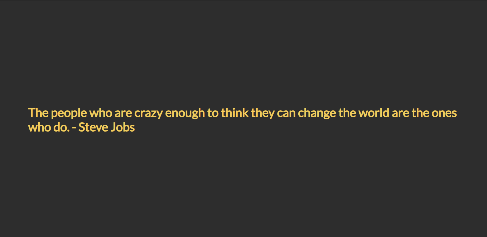

# Mastery Project: The Crazy Ones

### Getting Started :rocket:

Using array methods, you will guess the hidden quote.

Folow the instructions in [index.html](/index.html) to complete the challenge.

### Final result

#### Here is a [Live Demo](https://the-crazy-ones.netlify.app/)

The final result should look like this:

## A piece of advice

Use meaningful commit names and save your work regularly.

---

### Made with :orange_heart: in Berlin by @CodeWithDragos

© 2019 - 2020 CodeWithDragos. All Rights Reserved.
